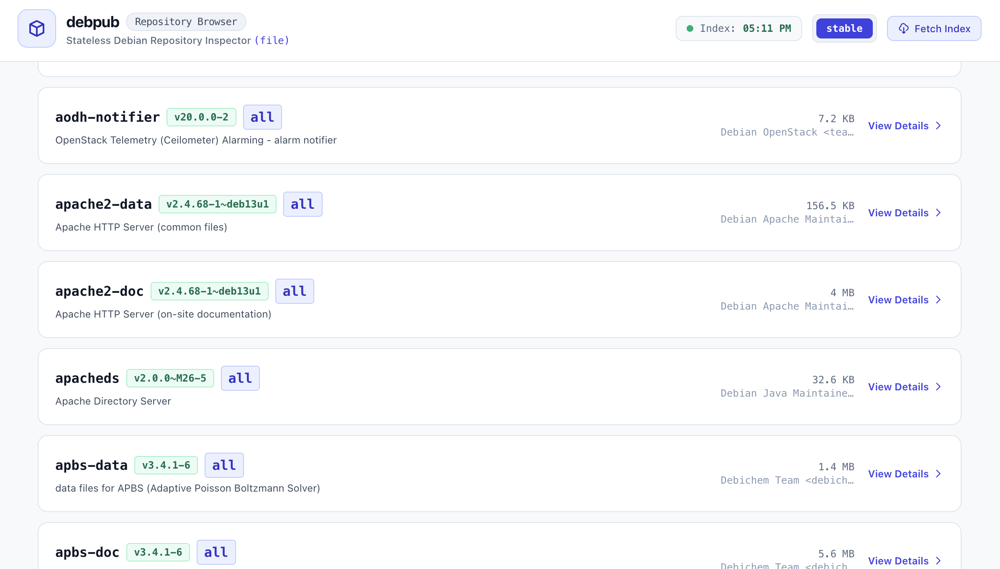

# debpub

[](https://opensource.org/licenses/Apache-2.0)
[](https://go.dev/)
[](https://github.com/fruitsforge/debpub/releases)
[](https://github.com/fruitsforge/debpub#authors--development)

> **Modern, stateless Debian repository packaging and publishing tool written in Go.**  
> Built for cloud-native CI/CD, ephemeral runners, and high-concurrency environments with distributed locking and full multi-stream compression (`gz`, `bz2`, `xz`).

---

## Why `debpub`?

Managing Debian repositories in modern CI/CD pipelines (such as **GitHub Actions**, **GitLab CI**, **Azure DevOps**, and **AWS CodeBuild**) has historically required compromising between two paradigms:

1. **The Heavy Database Dilemma (Aptly)**: Aptly requires an embedded database (LevelDB). Ephemeral runners must either maintain a 24/7 centralized API server or coordinate fragile database tarballs (`aptly-db.tar.gz`), risking state corruption during concurrent deployments.
2. **The Dependency & Compression Dilemma (`deb-s3`)**: While pioneering a stateless architecture, Ruby `deb-s3` requires installing Ruby and gem dependencies inside every CI runner, lacks native `Packages.bz2` or `.xz` compression, and is no longer actively maintained.

### The `debpub` Advantage

`debpub` combines the **stateless architecture** of `deb-s3` with the **speed, reliability, and single static binary distribution** of Go:

- 🚀 **Stateless Index Architecture**: The remote `Packages` manifest on S3, SFTP, or disk **is** the repository database. No LevelDB, SQLite, or state synchronization needed.
- 🔒 **Distributed Locking (`--lock`)**: Safe concurrent writes from multiple independent CI/CD runners using atomic `.lock` metadata with configurable TTL, automatic stale lock recovery, and S3 conditional writes (`If-None-Match: "*"`).
- 📦 **Modern Compression**: Native streaming generation and decompression of `Packages`, `Packages.gz`, **`Packages.bz2`**, and `Packages.xz`.
- 🌐 **Multi-Storage Protocols**: First-class support for **AWS S3** (and S3-compatible endpoints like MinIO, Ceph, Cloudflare R2), **SFTP** (SSH key authentication for Linux servers), and **Local Filesystem** (`file://`).
- 🖥️ **Embedded Repository Browser & REST API (`debpub serve`)**: Zero-dependency web server and interactive UI to browse packages, inspect metadata, filter versions, and sync indexes.
- ⚡ **Zero Runtime Dependencies**: A single self-contained static binary (< 20 MB). Runs cleanly in `scratch`, `alpine`, or minimal CI containers without external runtimes.

---

## Getting Started in 60 Seconds

### 1. Installation

#### Precompiled Static Binary
Download the precompiled static binary for your architecture from [GitHub Releases](https://github.com/fruitsforge/debpub/releases):

```bash
# Example for Linux amd64
curl -sSL -o /usr/local/bin/debpub https://github.com/fruitsforge/debpub/releases/latest/download/debpub_linux_amd64
chmod +x /usr/local/bin/debpub
```

#### Docker
Run `debpub` inside any container pipeline with zero installation:

```bash
docker run --rm -v $(pwd):/workspace ghcr.io/fruitsforge/debpub:latest publish --config debpub.json ./package.deb
```

### 2. Publish Your First Package

Publish a Debian package directly to an AWS S3 bucket with distributed locking:

```bash
debpub publish \
  --storage s3 \
  --bucket my-debian-repo \
  --codename bookworm \
  --component main \
  ./mypackage_1.0.0_amd64.deb
```

For local directories or static web servers:
```bash
debpub publish \
  --storage file \
  --dir /var/www/repos/apt \
  --codename bookworm \
  ./mypackage_1.0.0_amd64.deb
```

---

## Embedded Repository Browser (`debpub serve`)

Inspect and explore your repository with the built-in, zero-dependency web interface:

```bash
debpub serve --storage s3 --bucket my-debian-repo --server-port 8080
```

Open **`http://localhost:8080/`** to browse package versions, inspect dependencies, review Debian control paragraphs, and monitor repository indices.



---

## Documentation & Guides

For complete configuration options, advanced recipes, and command references:

- 📖 **[Usage Guide & Recipes](doc/usage-guide.md)**  
  Step-by-step cookbook for AWS S3, MinIO, Cloudflare R2, SFTP SSH authentication, dual-manifest GPG signing (`InRelease` + `Release.gpg`), and high-throughput batch uploads.
- ⚙️ **[Configuration Specification](doc/configuration.md)**  
  Annotated `debpub.json` schema, layered configuration precedence (CLI flags > Config file > Environment variables > Built-in defaults), and smart auto-detection rules.
- 📋 **[Command & Flag Reference](doc/reference.md)**  
  Full flag tables for `debpub publish` and `debpub serve`, along with REST API endpoint specifications.
- 🛠️ **[Developer & Contributor Guide](DEVELOPMENT.md)**  
  Building from source, running tests with race detector (`-race`), and using the Docker Compose test harness (MinIO + SFTP).

---

## Prior Art & Acknowledgments

`debpub` is built upon principles established by leaders in the Debian packaging ecosystem:

- **[deb-s3](https://github.com/deb-s3/deb-s3)**: Designed by Keith Rarick, morph027, and community contributors (MIT License). `debpub` adopts `deb-s3`'s stateless index philosophy and distributed lock semantics.
- **[aptly](https://github.com/aptly-dev/aptly)**: Designed by Andrey Smirnov and contributors (MIT License). `debpub` is informed by Aptly's Debian manifest generation and compression standards.

---

## Authors & Development

- **Architecture & Maintainer**: Vladimir & Contributors
- **Development**: Architected and developed with pair-programming assistance from Advanced AI Coding Agents (Google Antigravity / Gemini).

---

## License

`debpub` is open source software licensed under the **Apache License, Version 2.0**. See [LICENSE](LICENSE) for details.
